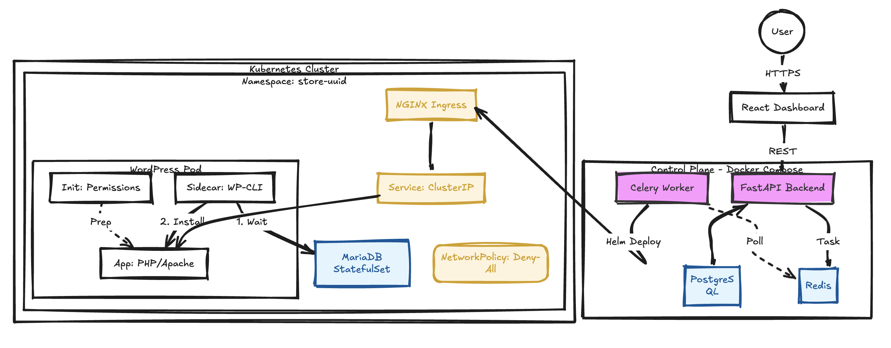

# Urumi Platform Architecture 

Urumi is a Kubernetes-native control plane designed to provision, secure, and manage isolated e-commerce environments (WooCommerce) at scale.

---

## 1. High-Level Architecture

The system follows an **Asynchronous Orchestrator** pattern. The User/API does not touch the cluster directly; instead, it dispatches intent to a queue, which is reconciled by a worker.

---

## 2. Design Patterns & Decisions

### A. The "Sidecar Provisioning" Pattern

#### Problem
In early iterations, the Python worker tried to run `kubectl exec` to install WordPress. This was fragile if the network dropped or the pod wasn't ready, the installation failed.

#### Solution
We moved the provisioning logic into the Pod itself using a **Sidecar container**.

**Component:** `wordpress:cli` container running alongside the main WordPress app.

**Responsibilities:**
1. Loop until `wp db check` (wait for MariaDB to be healthy)
2. Run `wp core install` (configure the site)
3. Run `wp user create` (create admin credentials)

#### Benefit
The pod becomes **self-healing**. If the pod restarts:
- The sidecar checks whether WordPress is already installed
- If installation is complete, it exits gracefully
- No external script dependency exists

---

### B. Strict Isolation Strategy

We treat every store as an **untrusted tenant**.

#### Namespace Isolation
Every store lives in `store-{uuid}`. This provides hard resource boundaries and RBAC isolation.

#### Network Policies (Zero Trust Model)
**Default:** Deny All (Ingress & Egress)

**Explicitly Allowed:**
- Ingress on Port 80 (from Ingress Controller)
- Egress to DNS (Port 53)
- Egress to MariaDB (Port 3306) within the same namespace

**Result:** A compromised store cannot scan the internal cluster network or communicate with other stores.

#### Resource Quotas
Each namespace has:
- 4.0 CPU
- 4Gi Memory

This prevents a **"Noisy Neighbor"** from starving the entire cluster.

---

### C. Reliability & Probes

#### Startup Probe (HTTP)
* **Mechanism:** We use a dedicated `startupProbe` targeting `/wp-login.php` with a high failure threshold (30 checks × 10s = 5 minutes).
* **Why:** The initial `wp core install` process performed by the sidecar can take time. The `startupProbe` pauses the `livenessProbe`, giving the application a 5-minute "Grace Period" to initialize.

#### Liveness Probe (HTTP)
Once started, we verify `/wp-login.php` to ensure the application is serving traffic.

---

## 3. Data Flow (End-to-End)

### 1. Request
User clicks **"Create Store"** → `POST /stores`

### 2. Queuing
Backend:
- Generates a UUID
- Saves state as `QUEUED` in PostgreSQL
- Pushes task to Redis

### 3. Provisioning
Worker:
- Picks up task
- Generates a random password
- Executes: `helm install store-{uuid} ...`

### 4. Initialization (Inside Kubernetes)
1. `init-container` fixes volume permissions
2. MariaDB starts
3. `wp-cli` sidecar waits for DB and installs WooCommerce
4. `startupProbe` passes

### 5. Completion
Worker:
- Verifies rollout status
- Updates Postgres state to `READY`

---

## 4. Scalability & Upgrades

### Horizontal Scaling Strategy
The platform components are stateless and scale independently:
1.  **API Server (`FastAPI`):** Can be scaled behind a Load Balancer.
2.  **Worker Nodes (`RQ`):** The provisioning queue allows us to run multiple worker processes across different nodes. Spikes in traffic simply accumulate in Redis.

### Upgrade & Rollback Strategy
We use **Helm Atomic Operations** for safe lifecycle management.
* **Upgrades:** When changing the store configuration, we run `helm upgrade --atomic --wait`.
* **Rollbacks:** If the new pod fails to start, Helm **automatically rolls back** to the previous working version, ensuring high availability.