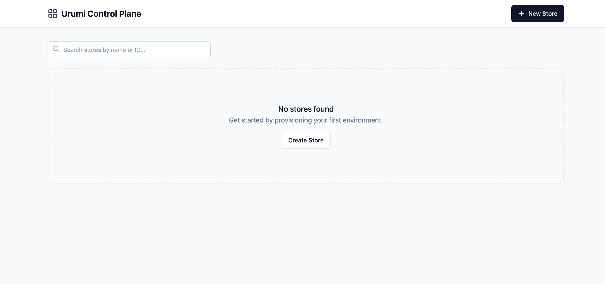
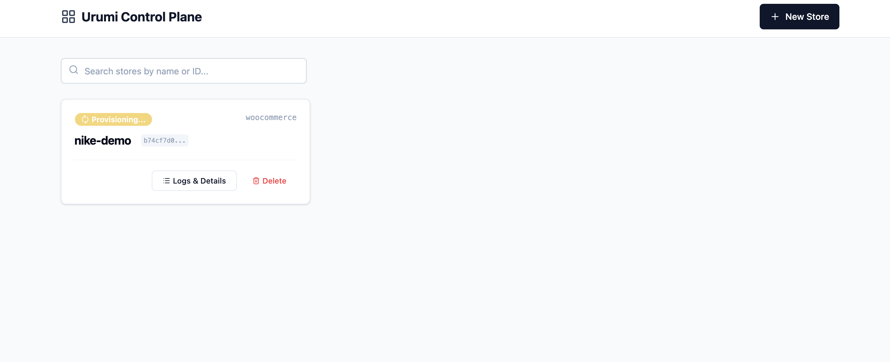
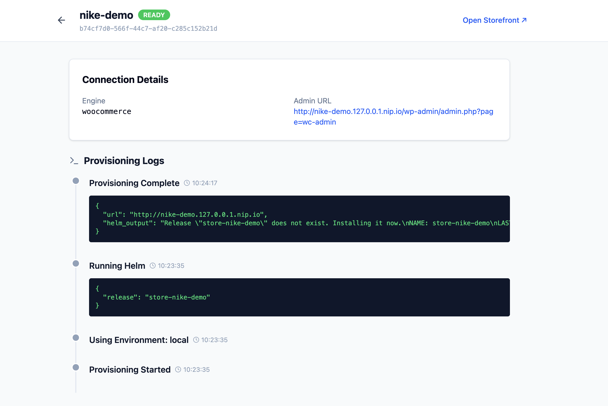

# Purrvision Control Plane (Store Orchestrator)

**A production-grade Control Plane for provisioning isolated e-commerce environments on Kubernetes.**

Purrvision is a self-service (Provisioning) platform that automates the deployment of WooCommerce stores. It treats every store as an **untrusted tenant**, enforcing strict network isolation, resource quotas, and security boundaries.

---

##  Dashboard Preview

| **1. Empty State** | **2. Provisioning (Real-time)** | **3. Audit Logs (Black Box)** |
|:---:|:---:|:---:|
|  |  |  |
| *Clean interface for one-click deployment.* | *Real-time status tracking via polling.* | *Full timeline of Helm/K8s events.* |

---

##  Key Features (Why this is Production-Ready)

### 1.  "Nuclear Codes" Security
*   **Zero-Trust Credentials:** Initial admin passwords are generated **once**, displayed **once**, and never stored in plaintext again.
*   **The "One-Time" Modal:** The UI forces the user to acknowledge they have copied the credentials before closing.

### 2.  Strict Tenant Isolation
*   **Namespace Boundary:** Every store gets its own namespace (`store-{uuid}`).
*   **Network Policies (Hardening):** Default `Deny-All` policy. Stores cannot talk to each other or scan the internal cluster.
    *   *Ingress:* Allow Port 80 (from Ingress Controller only).
    *   *Egress:* Allow DNS (Port 53) and MariaDB (Port 3306, internal only).
*   **Resource Quotas:** Hard limits (CPU/RAM) applied per namespace to prevent "Noisy Neighbor" issues.

### 3.  Resilient Provisioning (The Sidecar Pattern)
*   **Self-Healing:** We use a sidecar container (`wp-cli`) inside the Pod to handle installation.
*   **Benefit:** If the pod restarts or the DB isn't ready, the sidecar waits and retries automatically. No fragile `kubectl exec` scripts.

### 4.  Observability
*   **Audit Trail:** The backend captures every Helm command and Kubernetes event (`Provisioning Started`, `Helm Upgrade`, `Ready`).
*   **Timeline UI:** Users see exactly *what* is happening, demystifying the "Black Box" of Kubernetes.

---

##  Quick Start (Local)

**Prerequisites:** Docker, Kind, Kubectl, Helm.

### 1. Infrastructure Setup
Run the setup script to automate the cluster creation, Ingress Controller, and Helm Repo configuration:
```bash
./setup.sh
```

### 2. Start Backend & Worker
Open two terminal tabs:

**Tab 1: API Server**
```bash
source venv/bin/activate
uvicorn app.main:app --reload
```

**Tab 2: Worker (The Orchestrator)**
```bash
source venv/bin/activate
python -m app.worker
```

### 3. Start Frontend
**Tab 3: UI**
```bash
cd frontend
npm run dev
```

**Access Points:**
*   **Dashboard:** `http://localhost:5173`
*   **Storefronts:** `http://{store-name}.127.0.0.1.nip.io`

---

##  Deployment (VPS / Production)

This project is fully containerized for portability.

### 1. Clone on VPS
```bash
git clone https://github.com/yourusername/purrvision.git
cd purrvision
```

### 2. Run Production Deploy
```bash
chmod +x deploy_vps.sh
./deploy_vps.sh
```
This script installs Docker/Kind, patches the Kubeconfig for container access, and launches the full stack via Docker Compose.


Note ( in production edit both values-prod and tasks.py and put in your own domain )
---

## Trade-offs

In the interest of shipping a robust MVP within the timeframe, the following technical trade-offs were made:

### 1. Domain Generation Logic
*   **Current:** Domain construction (`.nip.io` vs `.store`) is currently handled in the Python backend logic for simplicity in the demo.
*   **Production Fix:** In a real environment, the base domain would be injected strictly via `values.yaml` or an environment variable (`BASE_DOMAIN`) to prevent configuration drift.

### 2. Secret Handling
*   **Current:** Passwords are passed to Helm via `--set` arguments. This is safe for a demo but visible in process lists.
*   **Production Fix:** I would pre-create a Kubernetes Secret object using the Python client and reference it in the Helm chart, ensuring passwords never appear in CLI logs.

### 3. Image Optimization
*   **Current:** The sidecar downloads the WooCommerce plugin at runtime. This ensures we always get the "latest" version but slows down startup.
*   **Production Fix:** Bake the plugin into a custom Docker image (`FROM wordpress:copy-plugins`) to ensure instant, deterministic startups.